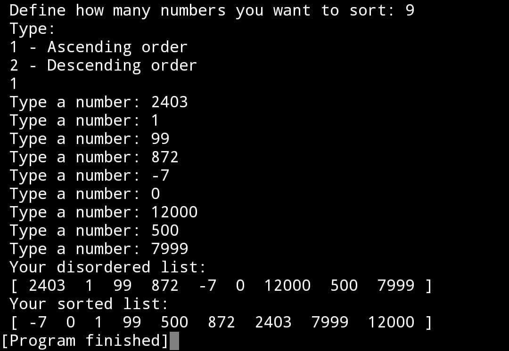

# SELECTION SORT

### What is that?

The selection-sort algorithm is a simple and intuitive sorting algorithm. It works by repeatedly selecting the smallest/largest element from the unordered list and moving it to the beginning. This process is repeated for each subsequent element until the entire list is sorted.

### Here is the basic procedure of the selection-sort algorithm:

1) Find the smallest/largest element in the unordered list.
2) Swap the smallest/largest element found with the first element of the unordered list.
3) Repeat steps 1 and 2 for the remainder of the unordered list, starting from the second element to the end of the list.

### Its Big O notation:

This algorithm has a time complexity of O(n^2), where 'n' is the number of elements in the list, making it less efficient compared to more advanced sorting algorithms such as quicksort or mergesort. However, it is easy to implement and can be useful for ordering small lists or as part of more complex algorithms.

## Example of using the program on a cell phone with the application "Cxxdroid - C/C++ compiler IDE:"

